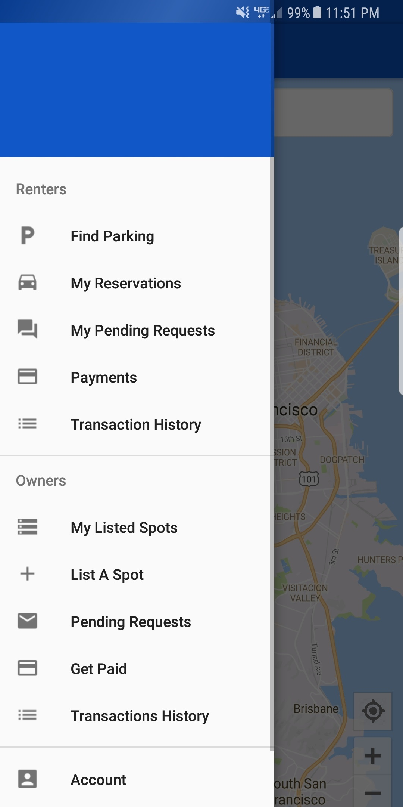

# Android Shared Parking App

Android app to facilitate parking arrangements between property owners and drivers. The app is integrated with Google Maps, Google Places, and Braintree. Not all functionality has been uploaded to this repository and all API keys have been removed.

